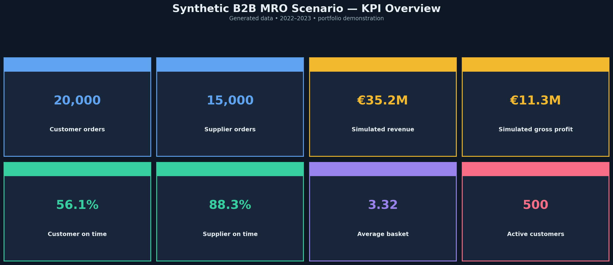
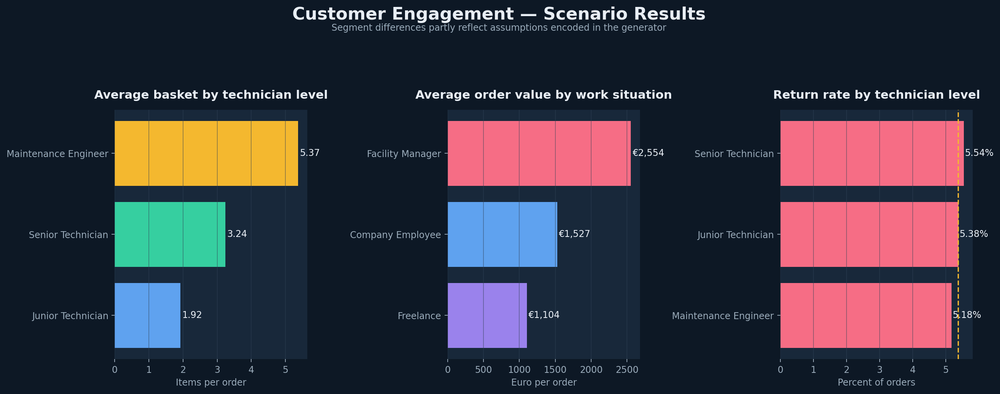
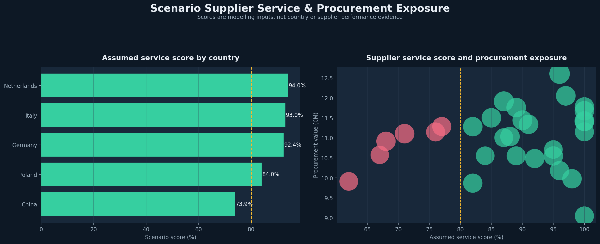
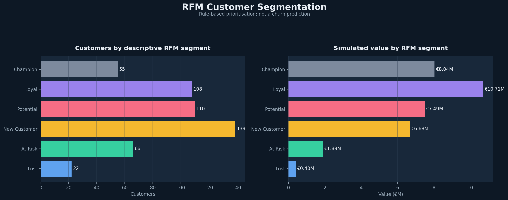

# B2B MRO Supply Chain Analytics

I built this project around a fictional German MRO distributor to connect customer purchasing, order fulfilment, supplier performance, and account segmentation in one analysis.

**Author:** Marziyeh Eslamparasti — Business Analyst, Hamburg

**Tools:** Python · Pandas · DuckDB (SQL) · Scikit-learn · Matplotlib

**Data:** Reproducible synthetic scenario; no confidential company records

## Questions I looked at

1. Which customer segments place larger and more valuable orders?
2. Where do fulfilment exceptions appear in the simulated order flow?
3. Which supplier relationships combine high spend with weak service scores?
4. Which customers merit retention or account-management attention?
5. Do rule-based RFM segments and data-driven clusters provide complementary views?

## Results from the fixed seed

| Measure | Result |
|---|---:|
| Customer orders | **20,000** |
| Supplier orders | **15,000** |
| Simulated revenue | **€35.2M** |
| Simulated gross profit | **€11.3M** |
| Average basket | **3.32 items** |
| Customer-order on-time rate | **56.1%** |
| Supplier-order on-time rate | **88.3%** |
| Maintenance Engineer / Junior basket ratio | **2.80×** |
| RFM “At Risk” revenue exposure | **€1.89M** |
| Best K-Means solution tested | **k = 4; silhouette = 0.335** |

Return rates are approximately **5.2%–5.5%** across technician levels. There is no meaningful segment difference in this run.

## About the data

The five tables are generated by `data_simulation.py`; no confidential company data is used. Basket size and supplier service levels are among the assumptions built into the script, so those patterns are not findings about the real MRO market.

The same delay process is used for every city. The 53.7%–57.0% spread is therefore sampling variation, not evidence of a real network-wide problem. I use the data to demonstrate the workflow and keep the assumptions visible throughout.

## Selected charts










All seven figures are available in [`reports/figures`](reports/figures).

## What is included

| Section | Decision focus |
|---|---|
| KPI overview | Scale, revenue, margin, basket size, and service levels |
| Customer engagement | Basket size and order value by technician level and work situation |
| Delivery performance | City scorecard and the delay-exception tail |
| SQL analysis | Year-over-year basket trends, supplier exposure, recency, and segment matrix |
| RFM segmentation | Account prioritisation based on recency, frequency, and monetary value |
| K-Means | Exploratory behavioural grouping and cluster profiles |

## Repository structure

```text
mro-supply-chain-analytics/
├── data/
│   └── README.md
├── notebooks/
│   └── mro_supply_chain_analysis.ipynb
├── reports/
│   └── figures/
├── src/
│   ├── utils.py
│   └── visualizations.py
├── .gitignore
├── data_simulation.py
├── README.md
└── requirements.txt
```

## Run locally

```bash
git clone https://github.com/marziyeh-ba/mro-supply-chain-analytics.git
cd mro-supply-chain-analytics
python -m venv .venv
source .venv/bin/activate       # Windows: .venv\Scripts\activate
pip install -r requirements.txt

# Generate the five linked CSV files in data/
python data_simulation.py

# Open the analysis
jupyter notebook notebooks/mro_supply_chain_analysis.ipynb
```

The random seed is fixed, so the same code and dependency versions reproduce the scenario. Generated CSVs remain local and are excluded from Git. Running the notebook also regenerates all seven figures from the local data.

## What I would add with real data

- Carrier, route, capacity, and service-level fields for delivery analysis.
- Order-line detail linking customer baskets to specific products.
- Contribution margin, service cost, and account context alongside RFM.
- Time-based validation and measurement of any sales or retention intervention.

## Methods used

Business analysis · supply-chain analytics · procurement analysis · KPI design · SQL · Python · synthetic-data modelling · customer segmentation · stakeholder-oriented communication

---

[LinkedIn](https://linkedin.com/in/marziyeh-eslamparasti) · [GitHub portfolio](https://github.com/marziyeh-ba)
